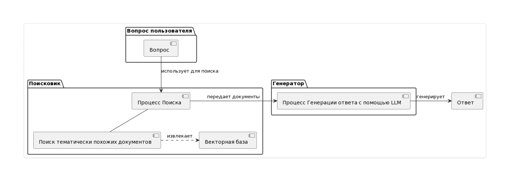

# Fine-tuning

## Описание

Этот репозиторий объединяет два подхода к адаптации LLM под задачи генерации SQL-запросов:

1. **Fine-tuning SQLCoder-7b (SFT + LoRA)** на кастомном датасете запросов

2. **Retrieval-Augmented Generation (RAG)** — использование внешней базы знаний (описаний таблиц, документации, схем) для улучшения генерации

Основная цель — получить модель, которая не только умеет писать корректные SQL-запросы, но и учитывает специфику конкретной базы данных

## Выбор модели

В проекте используется `SQLCoder-7b` — специализированная LLM для генерации SQL-запросов.

#### Почему именно SQLCoder-7b?

- Обучена на большом корпусе SQL-кода и оптимизирована именно под задачи SQL generation

- Хорошо справляется с:

    - вложенными подзапросами

    - сложными JOIN

    - агрегациями и фильтрацией

    - оптимизацией запросов

- Размер 7B параметров делает её хорошим компромиссом: модель достаточно мощная, чтобы справляться со сложными SQL-задачами, и при этом остаётся относительно лёгкой для практического использования и интеграции в рабочие пайплайны

## Fine-tuning (SFT + LoRA)

В проекте используется комбинация **Supervised Fine-Tuning (SFT)** и **LoRA (Low-Rank Adaptation)**. Такой подход позволяет эффективно адаптировать крупные языковые модели под специализированные задачи генерации SQL-запросов

### Supervised Fine-Tuning (SFT)

Вместо классической схемы "естественный язык → SQL-запрос" используется инструкционный формат датасета, где каждая запись содержит:

 - instruction — формулировка задачи для модели (например, оптимизация, рефакторинг или проверка SQL-запроса на эффективность и безопасность).

- input — исходный SQL-запрос, который может быть избыточным, неоптимальным или потенциально уязвимым.

- output — целевой результат: переписанный SQL, отвечающий лучшим практикам производительности и читаемости.

**Ключевые преимущества SFT**:

- Формирует у модели навык трансформации и оптимизации SQL-кода, а не только генерации новых запросов

- Позволяет обучить модель понимать контекст базы данных, потенциальные узкие места в запросах и оптимизационные паттерны

- Обеспечивает возможность обучения на специализированных кейсах, таких как индексация, агрегации, вложенные запросы, подзапросы с лишними проекциями и др.

- Даёт модели инструкционное понимание, что позволяет выполнять различные SQL-задачи в едином формате: анализ, оптимизация, исправление или рефакторинг

### Low-Rank Adaptation (LoRA)

**LoRA применяется для**:

- минимизации числа дообучаемых параметров (эффективность обучения на ограниченных ресурсах)

- ускорения экспериментов с различными задачами SQL (оптимизация, генерация, проверка)

### Синергия SFT + LoRA

- SFT формирует способность модели выполнять инструкции и трансформировать SQL-код с учётом лучших практик

- LoRA делает процесс адаптации ресурсно-эффективным и переносимым: адаптер можно применять к любым версиям SQLCoder без полного дообучения

- Результат — модель, способная:

    - анализировать и оптимизировать существующие SQL-запросы

    - выявлять избыточные конструкции и потенциальные узкие места

    - предлагать улучшенные варианты с учётом производительности и читаемости

## Автоматический поиск гиперпараметров (Optuna)

Для настройки fine-tuning в проекте используется Optuna — современный фреймворк для автоматизированного поиска гиперпараметров

Цель — минимизировать eval_loss на валидационном датасете и найти оптимальный набор параметров для SFT + LoRA.

**Что тюнингуется:**

- LoRA-конфигурация

    - `lora_r` (ранг матриц),

    - `lora_alpha` (коэффициент масштаба),

    - `lora_dropout`,

    - `target_modules` (выбор слоёв трансформера для применения LoRA),

    - `use_rslora`, `loftq_config` (дополнительные методы оптимизации)

- Оптимизация обучения

    - `learning_rate`, `weight_decay`, `num_train_epochs`,

    - `lr_scheduler_type`, `warmup_ratio`, `warmup_steps`,

    - `optim` (разные оптимизаторы: `adamw_torch`, `adamw_bnb_8bit`, `paged_adamw_32bit`)

- Batching и ресурсы

    - `per_device_train_batch_size`, `gradient_accumulation_steps`,

    - `fp16` / `bf16` (выбор формата чисел),

    - `gradient_checkpointing`, `max_grad_norm`,

    - `max_seq_length`, `packing`

- Стабильность и воспроизводимость

    - `seed`,

    - `dataloader_num_workers`

### Как это работает

1. Optuna запускает серию экспериментов (`trial`)

2. В каждом `trial` генерируется конфигурация гиперпараметров

3. Запускается обучение через SFTTrainer

4. Модель оценивается на валидационном датасете

5. Результат (`eval_loss`) репортится в Optuna

6. Используется Median Pruner, который прерывает неуспешные эксперименты, экономя ресурсы

## Retrieval-Augmented Generation (RAG)

Для сложных SQL-задач часто необходим контекст из внешних источников (документация, схемы баз данных, примеры прошлых запросов). Здесь применяется RAG:

 - Модель сначала достает релевантные документы или примеры из базы знаний

- Затем использует их как дополнительный контекст при генерации или оптимизации SQL-запроса

- Это позволяет создавать контекстно корректные и оптимизированные решения, даже если запрос содержит редкие конструкции или сложные подзапросы

RAG обеспечивает динамическую адаптацию модели к конкретной базе данных, позволяя:

- подсказывать оптимальные индексации и JOIN-структуры

- выявлять потенциальные узкие места производительности

- опираться на актуальные практики и корпоративные стандарты SQL

### Механизм Retrieval-Augmented Generation

---- 
Пайплайн проекта направлен на адаптацию LLM для анализа, оптимизации и рефакторинга SQL-кода, обеспечивая высокую эффективность и применимость модели в реальных задачах